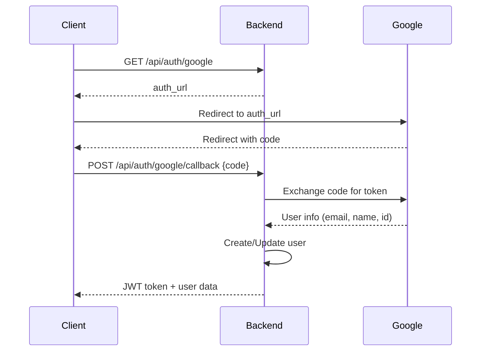

# PrepKit Architecture

## Tech Stack

**Backend:**
- FastAPI (Python web framework)
- PostgreSQL (database)
- SQLAlchemy (ORM)
- Alembic (migrations)
- JWT (authentication)
- Docker (containerization)

**Authentication:**
- Email/Password with bcrypt hashing
- Google OAuth 2.0
- JWT tokens (7-day expiration)

## Project Structure

```
backend/
├── app/
│   ├── main.py             # FastAPI app
│   ├── config.py           # Settings
│   ├── database.py         # SQLAlchemy setup
│   ├── dependencies.py     # JWT auth dependency
│   ├── models/             # SQLAlchemy models
│   ├── schemas/            # Pydantic models
│   ├── routers/            # API endpoints
│   ├── services/           # Business logic
│   └── utils/              # Security, OAuth, etc.
├── tests/                  # Pytest tests
├── alembic/                # DB migrations
└── Dockerfile
```

## Authentication Flow

### Email/Password
1. User registers: `POST /api/auth/register`
2. Password hashed with bcrypt
3. User stored in DB
4. JWT token generated & returned
5. Client stores token
6. Protected endpoints require `Authorization: Bearer <token>`

### Google OAuth
1. Client requests: `GET /api/auth/google`
2. Server returns Google auth URL
3. User authorizes on Google
4. Google redirects with code
5. Client sends code: `POST /api/auth/google/callback`
6. Server exchanges code for user info
7. User created/logged in
8. JWT token returned



## Security

- Passwords hashed with bcrypt (cost factor 12)
- JWT tokens signed with HS256
- Token expiration: 7 days (configurable)
- CORS configured for frontend only
- SQL injection prevented by SQLAlchemy ORM
- Input validation with Pydantic

## Database Schema

### Users Table

| Column | Type | Constraints | Description |
|--------|------|-------------|-------------|
| id | INTEGER | PRIMARY KEY | User ID |
| email | VARCHAR(255) | UNIQUE, NOT NULL | Email address |
| password_hash | VARCHAR(255) | NULLABLE | Hashed password (NULL for Google-only) |
| full_name | VARCHAR(100) | | User's full name |
| daily_calories | INTEGER | DEFAULT 2000 | Daily calorie goal |
| daily_protein | INTEGER | DEFAULT 150 | Daily protein goal (g) |
| daily_carbs | INTEGER | DEFAULT 200 | Daily carbs goal (g) |
| daily_fats | INTEGER | DEFAULT 70 | Daily fats goal (g) |
| weight_goal | DECIMAL(5,2) | NULLABLE | Weight goal (kg) |
| google_id | VARCHAR(255) | UNIQUE, NULLABLE | Google OAuth ID |
| is_active | BOOLEAN | DEFAULT TRUE | Account active status |
| is_verified | BOOLEAN | DEFAULT FALSE | Email verified |
| created_at | TIMESTAMP | DEFAULT NOW() | Creation timestamp |
| updated_at | TIMESTAMP | DEFAULT NOW() | Last update timestamp |
| last_login | TIMESTAMP | NULLABLE | Last login timestamp |

**Constraints:**
- CHECK: `(password_hash IS NOT NULL) OR (google_id IS NOT NULL)`

**Indexes:**
- `idx_users_email` on email
- `idx_users_google_id` on google_id
- `idx_users_created_at` on created_at

## API Design Conventions

### Request/Response Flow
1. Client sends request with optional JWT in header
2. Middleware validates JWT (if protected route)
3. Router passes request to Service layer
4. Service executes business logic, interacts with DB
5. Service returns Pydantic response model
6. FastAPI serializes to JSON

### Error Handling
- 400: Bad Request (validation errors, duplicate email)
- 401: Unauthorized (invalid/missing token)
- 403: Forbidden (inactive account)
- 404: Not Found (resource doesn't exist)
- 500: Internal Server Error (logged, generic message to user)

### Response Models
All responses use Pydantic models for:
- Type safety
- Automatic serialization
- OpenAPI documentation
- Validation

## Deployment Considerations

### Production Checklist
- [ ] Set strong SECRET_KEY
- [ ] Use production PostgreSQL (not in Docker)
- [ ] Enable HTTPS (reverse proxy)
- [ ] Configure proper CORS origins
- [ ] Set up email verification
- [ ] Implement rate limiting
- [ ] Add logging & monitoring
- [ ] Set up backup strategy
- [ ] Use environment-specific configs

### Scaling
- Horizontal scaling: StatelessJWT approach allows multiple backend instances
- Database: Connection pooling configured (pool_size=10, max_overflow=20)
- Caching: Redis can be added for session/token blacklisting

## Future Enhancements

Module 2 will add:
- Recipe management
- Meal planning
- Shopping lists
- Barcode scanning
- Nutrition tracking

See `CODE_GENERATION_GUIDE.md` for development patterns.
